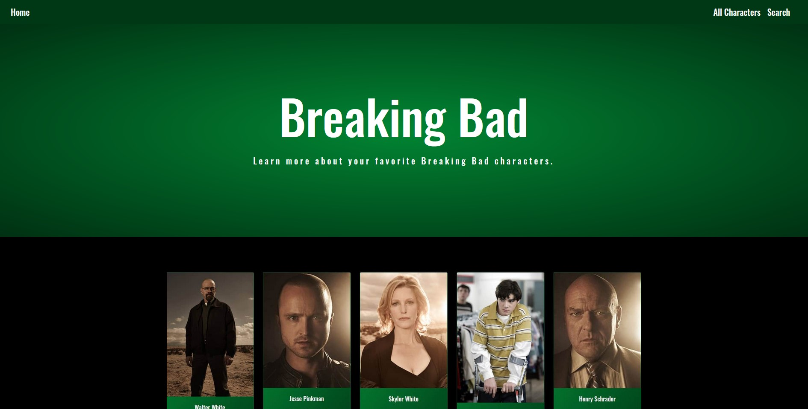

# Breaking Bad Fan Site

Basic front end site that uses the Breaking Bad API to search character details. 

|   |   |
|---|---|

## Introduction 

I created this site because I'm a Breaking Bad fan and it was a way to practice front end development.  

### Features

* Grid Style Layout

   


* Uses the Breaking Bad API
* Responsive Design


### Technologies

* Bootstrap 4.5.0
* Webpack 5.0.0-beta.22
* JavaScript 
* jQuery
* CSS
* HTML
* npm

### Installation 

This app requires [Node.js](https://node.js.org/) v14.4.0 to run

Install the dependecies

```sh
$ npm install
```

Start the dev server

```sh
$ cd breaking-bad-front-end
$ npm run serve
```

For production build

```sh
npm run build
```

### Sources 

This site was largerly inspired by the Milo - Magazine/Blog Theme by the Bootlab team. [Breaking Bad API](https://www.breakingbadapi.com/)